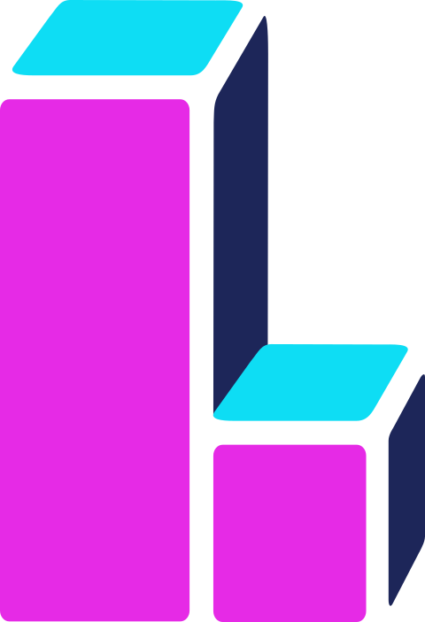

# Quests
<div align="center" name="inicio">
  <a href="https://quests-iota.vercel.app"></a>

  ###### Keywords: Projeto Integrado I - Linos - Sistemas e Mídias Digitais - Universidade Federal do Ceará
</div>

## :page_with_curl: Sumário:
<ul>
 <a href="#sobre"><li>Sobre</li></a> 
 <a href="#equipe"><li>Equipe</li></a> 
 <a href="#requisitos"><li>Requisitos</li></a> 
 <a href="#tecnologias"><li>Tecnologias</li></a>
 <a href="#como-rodar"><li>Como rodar o código</li></a>
 <a href="#hospedagem"><li>Hospedagem</li></a>
 <a href="#license"><li>Licença</li></a>
</ul>

<a name='sobre'></a>

## :speech_balloon: Descrição do Projeto

<p>
  Quests é uma aplicação Web que está sendo desenvolvida para a professora do curso de Sistema e Mídias Digitais - UFC, Ticianne Darin, para atender a demanda de questionários do grupo de pesquisa Célula Multimídia pelo qual é responsável. A aplicação tem por finalidade divulgar questionários e aumentar a adesão e o engajamento de respondentes através de um sistema de recompensas. O público-alvo da plataforma são os pesquisadores, pessoas responsáveis por coletar dados por meio de questionários, e respondentes, pessoas interessadas em responder questionários tendo, assim, dois perfis de usuário, os quais podem se combinar: o pesquisador, que vai utilizar a plataforma para divulgar o link do seu questionário; e o respondente que por intermédio da plataforma vai acessar ao link do formulário, preenchê-lo e acumular recompensas no seu perfil.
</p>


<a name="equipe"></a>

## :busts_in_silhouette: Equipe Linos - linosdesingsmd@gmail.com 

<div align="center">
  <a href="https://github.com/smdlinos">
    
    </a>
</div>
<br>
<div align="center">

| Membro   | Email     |  Função | Icon
|--       |--         |--      |--      
| Luiz Gonzaga     | luis.gsantosf@gmail.com     | Lider e UX Research | :bear:    |
| Maria Clara|    mariaclaraminion@gmail.com     |  Desenvolvedora Fullstack | :tiger: |
| Vitória Jessica|   ebvitoriajessica@gmail.com     |  Designer e Ilustradora | :bird: |
| Victor Emanuel   |  victoremanuel.vet8@gmail.com | Desenvolvedor Back-end | :penguin:  |
| Letícia Nepomuceno |  leticianepomuceno23@gmail.com  |  Designer UX/UI |   :lion:|
| Mickael Castro |  mickaelcastro15@gmail.com | Desenvolvedor Front-end  | :koala:  |


  ### Github
</div>

## :busts_in_silhouette: Equipe Linos - linosdesingsmd@gmail.com

- [Letinepo](https://github.com/letinepo) 
- [Avie](https://github.com/vitoriajessicapr) 
- [Luiz](https://github.com/LUISGSFILHO) 
- [Vitao](https://github.com/victor280504) 
- [Macla](https://github.com/claraolvrx) 
- [Mickas](https://github.com/mickael-castro) 


<a name="requisitos"></a>

## :dart: Requisitos funcionais
  
Projeto em Construção - Funcionalidades atuais da Aplicação

|  Código     |  Descrição                  | Status    | 
|  ---------  |  -------------------------- | --------- |
|  RF0001     |  Fazer cadastro do usuário  | FEITO     |
|  RF0002     |  Entrar como visitante      | FEITO     |
|  RF0003     |  Fazer login de usuário     | FEITO     |
|  RF0004     |  Recuperar senha            | FEITO     |
|  RF0005     |  Visualizar tela principal  | FEITO     |
|  RF0006     |  Acessar perfil do usuário  | FEITO     |
|  RF0007     |  Cadastrar/Atualizar informações do perfil  | FEITO  |
|  RF0008     |  Visualizar registro de recompensas  |EM DESENVOLVIMENTO  |
|  RF0009     |  Visualizar progresso no tabuleiro  |EM DESENVOLVIMENTO  |
|  RF0010     |   Gerar certificado de horas complementares  | FEITO  |
|  RF0011     |  Buscar um questionário  | FEITO  |
|  RF0012     |  Acessar link para responder questionário  | FEITO |
|  RF0013     |  Receber feedbacks de progresso no tabuleiro  | EM DESENVOLVIMENTO  |
|  RF0014     |  Gerar recomendações de questionário | FEITO  |
|  RF0015     |  Customização do personagem  | EM DESENVOLVIMENTO|
|  RF0016     |  Acessar Landing Page  | SUSPENSO  |
|  RF0017     |  Deletar Perfil  | FEITO  |
|  RF0018     |  Visualizar Histórico de Questionários Respondidos | FEITO  |
|  RF0019    |  Validar Código de Resposta  | EM DESENVOLVIMENTO|
|  RF0020    |  Receber feedback de preenchimento do cadastro | FEITO|
|  RF0021    |  Receber ajuda em atividades específicas na plataforma   | FEITO

<a name="tecnologias"></a>

## :mag: Tecnologias Utilizadas

  ### JavaScript: 
  A linguagem base a ser usada no projeto é JavaScript, por se tratar de uma ferramenta web e “Client-side”, envolvendo a linguagem de marcação HTML, além do mecanismo de estilos web CSS, vimos que a mesma seria de fácil manuseio para a criação da aplicação no site inicialmente.

  <h3>Front-end</h3>  
  React: Escolhemos react por se tratar de uma biblioteca JavaScript para criação de interfaces de usuários, possibilitando a reutilização de código e acelerando o processo de desenvolvimento, além de reduzir custos de produção. Outrossim, o framework foi uma sugestão do cliente, tanto na forma de organização e criação da aplicação.
  Bootstrap: Um framework front-end que fornece estruturas de CSS para a criação de sites e aplicações responsivas.
  React-Bootstrap: O react-bootstrap é uma biblioteca que nos oferece os componentes Bootstrap construídos em React.

  <h3>Back-end</h3>
  PHP: como um ambiente de desenvolvimento voltado aos servidores, o PHP foi escolhido por ter grande compatibilidade e afinidade com o software de banco de dados a ser usado na aplicação, o MySQL. Para além disso, o mesmo possui grande afinidade também com o próprio JavaScript e Html, os meios base da aplicação em um geral.

  <h3>Banco de dados</h3>
  MySQL:  Escolhemos essa tecnologia para banco de dados pois o PHP e MySQL possuem total compatibilidade, e funcionam muito bem juntos. Outros fatores são a implementação leve que proporciona maior velocidade de uso e a sua facilidade de integração entre servidor Web e linguagens de programação.

<a name="como-rodar"></a>

## :computer: Como rodar

### Clonando o repositório

```shell
git clone https://github.com/smdlinos/Projeto_Linos.git
cd Projeto_Linos
```

### Como Rodar o Front-end:
Abra o terminal, na pasta do código do seu editor, e digite os seguintes comandos:
##### Atenção : Você precisa ter o Node.js instalado em sua máquina
```shell
  npm install react-scripts --save
  cd React
  npm start
```

### Como Rodar o Back-end:
  Para rodar o Back-end, precisa-se utilizar um servidor (Apache) na máquina local para poder rodar o projeto, ademais um servidor MySQL para o banco de dados. Atualmente utilizamos o XAMPP no ambiente de desenvolvimento, que fornece os dois serviços necessários para que o projeto possa rodar na sua máquina.
  
 Com o servidor rodando, você deve configurar o seu banco de dados para que ele esteja de acordo com as necessidades do projeto. Para isso, primeiramente você deve entrar no Sistema Gerenciador de Banco de dados fornecido pelo XAMPP, o phpmyadmin , e em seguida importar o arquivo padrão do banco de dados que contempla as funcionalidades do projeto e que está disponível no aquivo '/api/quests.sql'. Após isso você deve fazer as configurações de conexão com o banco de dados no arquivo '/api/.env'. 
 Caso esse arquivo não exista na sua máquina você deve criar um arquivo .env dentro da raiz da api , './api' e em seguida colar a estrutura de exemplo que está em '/api/.env.example' e configurar de acordo com as suas informações.
 
  ```shell
  URL = http://localhost/api
  DB_HOST=localhost
  DB_NAME=database
  DB_USER=root
  DB_PASS=your_password_database
  DB_PORT=3306
  MAINTENANCE=false
  EMAIL=email@eexample.com
  PASSWORD=your_password_to_application
  KEY = escolhaasuachavedecriptografia
```

##### Atenção: Os campos email e password, dizem respeito às configurações da funcionalidade de redefinir senha, no campo *email* deve constar o email do remetente, e no *password* a senha de aplicação correspondente ao email.

Com o .env configurado,  a api está pronta para ser usada, certifique-se apenas de que todos os endpoints em que você deseja fazer requisões que estejam corretos do lado do cliente.
#### Todas as rotas disponíveis estão distribuídas nos arquivos da pasta *'./api/routes/api/v1'*

  Por fim basta colar a pasta do back-end 'api' , dentro do arquivo 'htdocs' no XAMPP e ligar o seu servidor local.
 

<a name="hospedagem"></a>
## :construction_worker: Hospedagem

O projeto atualmente se encontra hospedado em duas plataformas, a <a href='https://000webhost.com'>000webhost</a> para a api e o vercel para o front-end. O <a href='https://vercel.com'>vercel </a>é uma plataforma voltada para a hospedagem de aplicações de uma forma bem simples e rápida e possui suporte para o React, já o 000webhost é um serviço que oferece hospedagem de site de custo zero com PHP, MySQL, cPanel sem anúncios.

Os respectivos links de cada projeto:
Api: https://smdquests.000webhostapp.com/api/v1
React: https://quests-iota.vercel.app

<a name="license"></a>
## :memo: Licença

<a href="https://github.com/smdlinos/Projeto_Linos/blob/main/LICENSE">Licença GPL-3.0</a>
